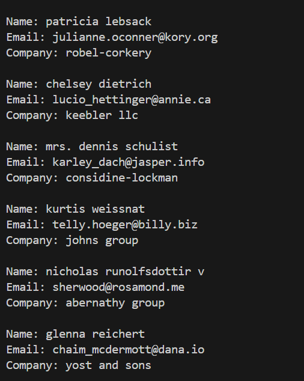

# Golang Fetch jso type

The service package is a simple Go module designed to fetch and display user data from an external API. It outputs user information including name, email, and company name, all converted to lowercase for consistency.

# 🔧 Key Features

- Fetches JSON data from the endpoint: https://jsonplaceholder.typicode.com/users

- Parses the JSON response into a custom Datas struct

- Displays Name, Email, and Company Name in lowercase format

- Handles HTTP and JSON parsing errors gracefully

## Preview



## How To Run This Project

### Manual

1. Clone this repository

```bash
git clone https://github.com/HN721/fgo24-go-json-unmarshal.git
```

2. Get into the path

```bash
cd fgo24-Tickitz
```

3. Install the dependencies

```bash
go mod init
```

4. Run the project

```bash
go run main.go
```

## Contributing

We welcome contributions! 🚀

If you would like to open a Pull Request (PR), please follow these steps:

1. Fork this repository.

2. Create a new branch:

```
git checkout -b feature/your-feature-name
```

3. Make your changes.

4. Commit your changes with a clear message:

```
git commit -m "Add: your featusre description"
Push your branch to your fork:
```

```
git push origin feature/your-feature-name
```

5. Open a Pull Request (PR) to the main branch of this repository.

6. Make sure your code is clean, well-tested, and consistent with the project style.

7. License
   This project is open-source and available under the MIT License.

# Enjoy exploring and contributing to the Survey Application! 🎉
